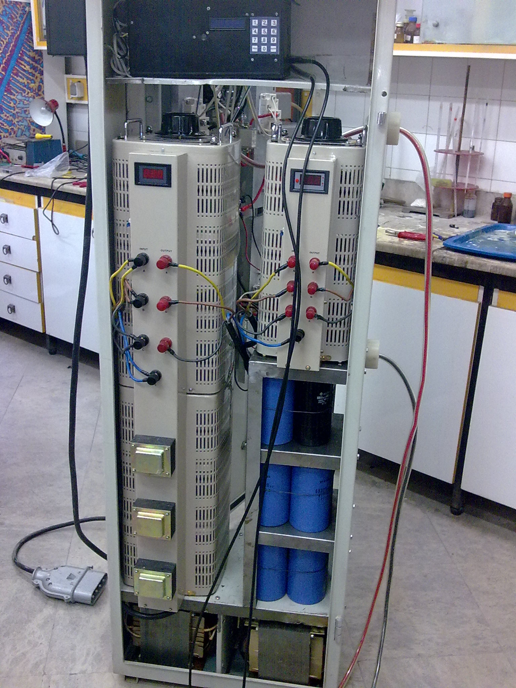
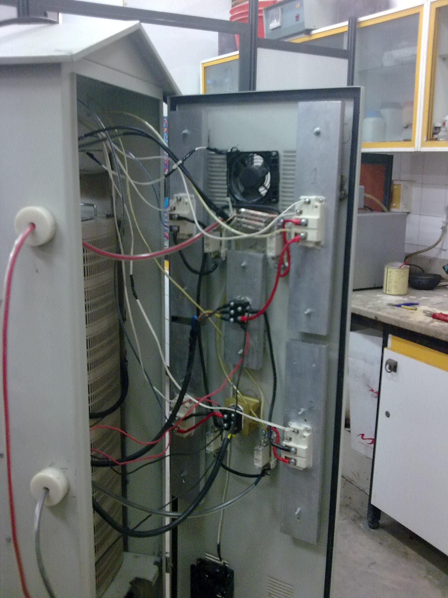

# Plasma Coating

In the plasma coating method, by applying a strong electric field between the two poles of the anode and cathode, the gas bubbles around the sample is ionized and after ignition (which corresponds to the type of electrolyte has different colors) at an optimal voltage (less than 300 V), a plasma forms continuously around the cathode. Which leads to the acceleration of positive ions inside the electrolyte towards the sample or cathode, and thus a coating with desirable properties is created on its surface.   
A unit for the Plasma Coating Process consists of a bath and a powerful electrical source. For this purpose, a three-phase kilowatt variable device was first prepared. The output power was rectified by a number of diodes and the negative pole was connected to the sample and the positive pole to the system. The **surface-to-cathode ratio** is more than **50 times**, which results in a uniform distribution of current on the sample surface. The coating operation was performed on a 2 liter Beaker. And they were placed inside a Beaker in the form of a 304 stainless steel cylinder (with a mesh).  
At low voltage, the current increases linearly with increasing voltage according to Faraday law. This area is associated with the presence of gas, which is mainly H2.  
With a further increase of the voltage we reach a point - This area is recognizable by the presence of glowing gas which is not stable due to fluctuations in current - When the voltage increases, the cathode is continuously surrounded by a gas vapor plasma, which is detected by a sharp drop in current. This is the EPT operating area where the plasma is stable and where surface operation can be controlled.

Video:  
<a href="14May2009C.avi">avi Video</a>

<video width="320" height="240" controls>
  <source src="14May2009C.avi">
  Your browser does not support the video tag.
</video>